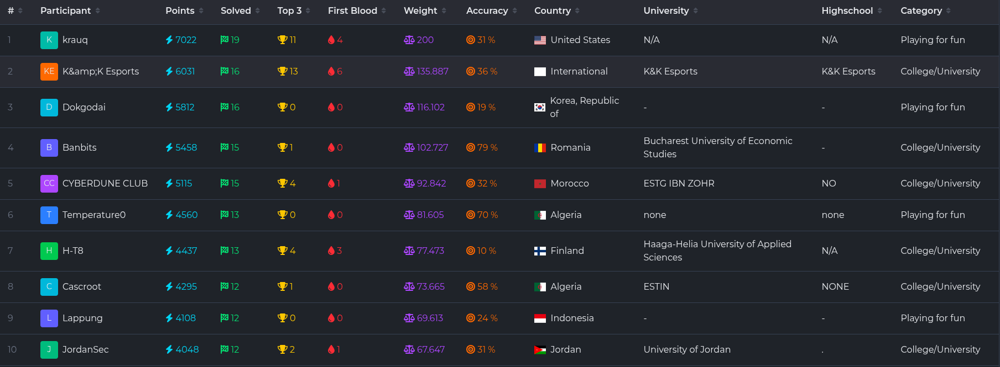

<div align="center">
  <h1>CYBERDUNE CLUB | UNbreakable International 2026</h1>
  <p><strong>Team Phase Writeups and Solver Scripts</strong></p>
  <p><strong>Top 5 overall</strong> · <strong>Top 1 team from Morocco</strong></p>
</div>

This repository collects the challenge writeups and helper scripts prepared by **CYBERDUNE CLUB** during the **UNbreakable International 2026 - Team Phase**.

## Event Highlights

<p align="center">
  
  
</p>

## Highlights

- 13 documented solves across crypto, forensics, network, pwn, reverse, threat hunting, and web
- writeups include exploitation notes, reversing details, and reproducible helper scripts
- repository organized by category for fast navigation

## Repository Overview

Each challenge folder contains a technical writeup and, where useful, a helper or exploit script used to reproduce the solve path.

### Crypto

- [crypto/toxicwaste](./crypto/toxicwaste/README.md): recover a shuffled KZG SRS with pairings, extend it with the leaked toxic-waste relation, and forge a degree-41 opening.
- [crypto/riga-crypto](./crypto/riga-crypto/README.md): peel open the npm dropper, extract the hidden PyInstaller payload, and recover the poem-based flag that matches `flag.enc`.

### Forensics

- [forensics/unholy-land](./forensics/unholy-land/README.md): parse a Suricata `eve.json`, count flows and DNS activity, and identify the malware family as `holycat`.

### Network

- [network/relay](./network/relay/README.md): separate the fake UDP noise from the real KISS/AX.25 relay stream, recover the APRS hints, and extract the final flag.

### Pwn

- [pwn/atypical-heap](./pwn/atypical-heap/README.md): recover musl `mallocng` metadata from an over-read, turn it into a libc leak, and hijack musl exit hooks to execute `system("cat flag.txt")`.
- [pwn/atypical-heap-revenge](./pwn/atypical-heap-revenge/README.md): combine an out-of-bounds read with a hidden arbitrary write, then reuse the musl exit-hook path for code execution.

### Reverse

- [reverse/jumpy](./reverse/jumpy/README.md): reconstruct the custom block cipher hidden behind the self-decrypting VM-like handler flow and decrypt `enc.sky`.
- [reverse/substrate](./reverse/substrate/README.md): lift the driver-side matrix logic from `SubstrateKM.sys` and invert the per-block transformation to recover the validated flag.
- [reverse/webd-art](./reverse/webd-art/README.md): reverse the Dart-to-WASM byte generator behind the fake randomness and rebuild the hidden flag.

### Threat Hunting

- [threat-hunting/control](./threat-hunting/control/README.md): investigate the Winlogbeat and Sysmon export to recover the download source, execution chain, persistence, privilege escalation, migration target, and LSASS dumping path.

### Web

- [web/demolition](./web/demolition/README.md): exploit the Python-versus-Go sanitizer mismatch by using `ſcript`, achieve same-origin bot XSS, and steal the flag cookie.
- [web/nday-1](./web/nday-1/README.md): abuse default Airflow admin access plus an exposed example DAG that feeds untrusted JSON into a `BashOperator`, then read `/flag.txt` from task logs.
- [web/svfgp](./web/svfgp/README.md): recover a sealed `localStorage` flag from the bot with a popup timing oracle on `startsWith()` plus a 3,000,000-iteration PBKDF2 branch.

## Structure

```text
crypto/
forensics/
network/
pwn/
reverse/
threat-hunting/
web/
assets/
```

## Team

**CYBERDUNE CLUB**  
UNbreakable International 2026 - Team Phase  
Top 5 overall | Top 1 Morocco
